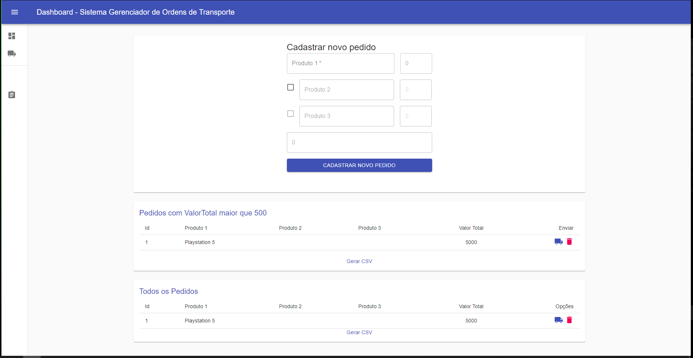
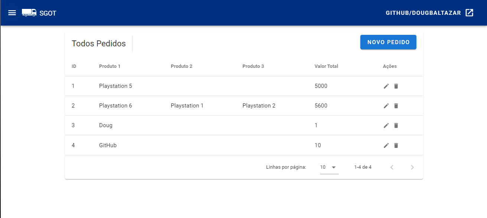
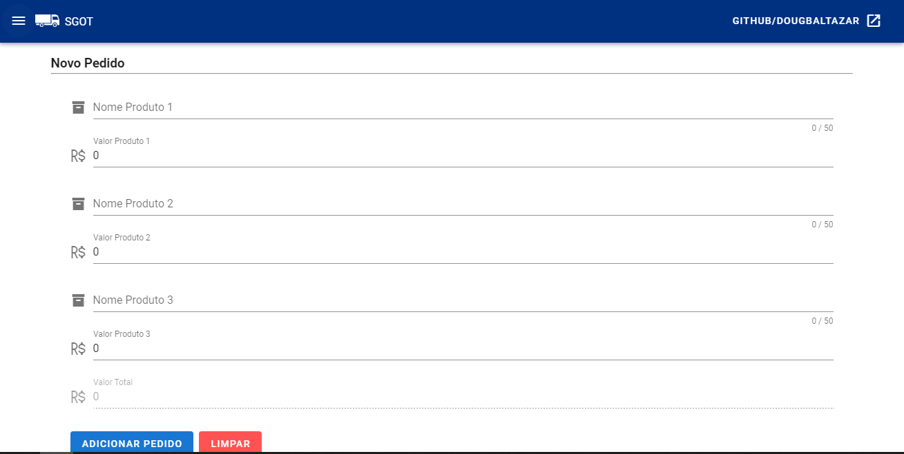
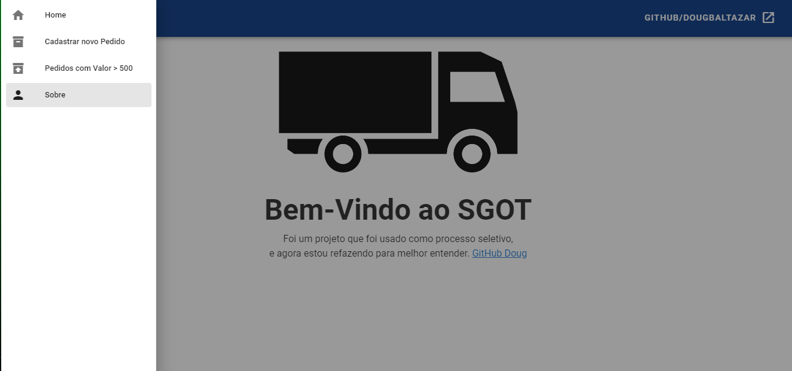

# SGOT
O Sgot foi um processo seletivo que me foi proposto, acabei por refazer-lo para estudar mais.

### Imagem do primeiro projeto em React:


## Imagens em Vue


### Inicial


### Form


### Sobre / NavBar



Houve muita melhora de um projeto para o outro, o conceito de SPA foi bastante utilizado, e continuou usando o back-end do passado que foi feito em SpringBoot.

## Back-end utilizado:

### [SGOT-BackEnd](https://github.com/douglasbaltazar/SGOT-BackEnd)


<br>

<br>


## Project setup
```
npm install
```

### Compiles and hot-reloads for development
```
npm run serve
```

### Compiles and minifies for production
```
npm run build
```

### Lints and fixes files
```
npm run lint
```

### Customize configuration
See [Configuration Reference](https://cli.vuejs.org/config/).
